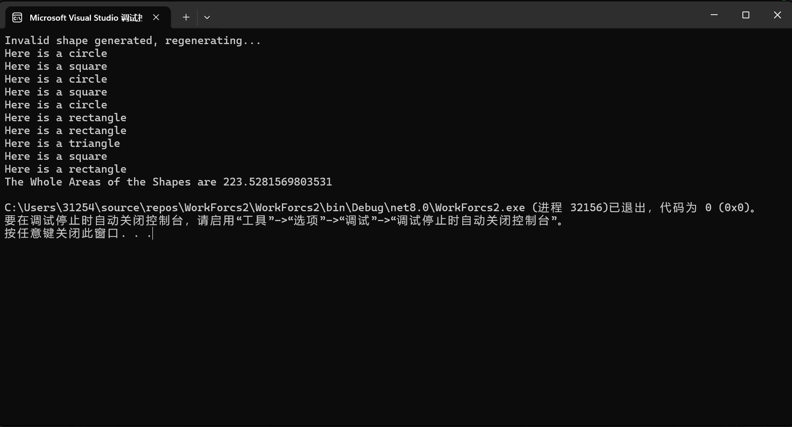

# 第二次作业
## 说明
* 此程序以double[]来描述图形，因此如正方形、矩形等未考虑成角度问题，但足够用来展示C#面向对象的特性  
* 题目要求随机生成10个图形，计算总面积。但是直接使用随机数生成器的话，生成正方形和矩形的概率极低，因此加入了type，用以规范随机数生成图形参数  
* 考虑到即便是规范后，三角形的生成依然存在不合法的情况，因此在循环内加入判断条件，调用IsValid函数，确保生成的10个图形均合法，便于计算总面积  
* 用数组直接代表图形的问题在于圆不好表示，因为传统上，圆的参数是圆心(Point2)和半径，但是这就会和Shape里的定义冲突，没办法直接用多态，所以这里把Edge定义为边长，圆只有一条边，所以边长就是周长，再用type进行选择，用两类随机数取了个巧.

## 运行结果
